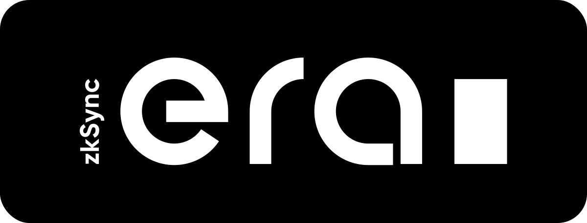

# zkSync Era: Solidity Compiler

zkSync Era is a layer 2 rollup that uses zero-knowledge proofs to scale Ethereum without compromising on security
or decentralization. As it's EVM-compatible (with Solidity/Vyper), 99% of Ethereum projects can redeploy without
needing to refactor or re-audit any code. zkSync Era also uses an LLVM-based compiler that will eventually enable
developers to write smart contracts in popular languages such as C++ and Rust.

This repository contains the compiler from Solidity to zkEVM bytecode.

## Building

1. Install some tools system-wide:  
   1.a. `apt install cmake ninja-build clang-13 lld-13 parallel` on a Debian-based Linux, with optional `musl-tools` if you need a `musl` build  
   1.b. `pacman -S cmake ninja clang lld parallel` on an Arch-based Linux  
   1.c. On MacOS, install the [HomeBrew](https://brew.sh) package manager (being careful to install it as the appropriate user), then `brew install cmake ninja coreutils parallel`. Install your choice of a recent LLVM/[Clang](https://clang.llvm.org) compiler, e.g. via [Xcode](https://developer.apple.com/xcode/), [Apple’s Command Line Tools](https://developer.apple.com/library/archive/technotes/tn2339/_index.html), or your preferred package manager.  
   1.d. Their equivalents with other package managers  

2. [Install Rust](https://www.rust-lang.org/tools/install)

   Currently we are not pinned to any specific version of Rust, so just install the latest stable build for your platform.
   Also install the `musl` target if you are compiling on Linux in order to distribute the binary:
   `rustup target add x86_64-unknown-linux-musl`

3. Check out or clone the appropriate branch of this repository.

4. Go to the project root and run `git checkout <ref>` with the tag, branch, or commit you want to build.

5. Install the zkEVM LLVM framework builder:
   5.a. `cargo install compiler-llvm-builder` on MacOS, or Linux for personal use
   5.b. `cargo install compiler-llvm-builder --target x86_64-unknown-linux-musl` on Linux for distribution

   The builder is not the [zkEVM LLVM framework](https://github.com/matter-labs/compiler-llvm) itself; it is just a tool that clones our repository and runs the sequence of build commands. By default it is installed in `~/.cargo/bin/`, which is recommended to be added to your `$PATH`. Execute `zkevm-llvm --help` for more information.
   If you need a specific branch of zkEVM LLVM, change it in the `LLVM.lock` file at the root of this repository.

6. Run the builder to clone and build the zkevm LLVM framework at this repository root:
   6.1. `zkevm-llvm clone`
   6.2. `zkevm-llvm build`

7. Build the Solidity compiler executable:
   7.a. `cargo build --release` on MacOS or Linux for personal use
   7.b. `cargo build --release --target x86_64-unknown-linux-musl` on Linux for distribution

8. If you need to move the built binary elsewhere, grab it from the build directory:
   8.a. On MacOS or Linux for the default target:
   `./target/release/zksolc`  
   8.b. On Linux, if you are building for the target `x86_64-unknown-linux-musl`:
   `./target/x86_64-unknown-linux-musl/release/zksolc`

## Usage

Check `./target/*/zksolc --help` for the compiler usage.  

> The `solc` compiler must be available in `$PATH`, or the `--solc` option must be used instead.  

For big projects it is more convenient to use the compiler via the hardhat plugin. For single-file contract or small
projects, however, the CLI is more than fine.  

## Troubleshooting

- If you get a “failed to authenticate when downloading repository… if the git CLI succeeds then net.git-fetch-with-cli may help here” error,
then prepending the `cargo` command with `CARGO_NET_GIT_FETCH_WITH_CLI=true`
may help.
- On MacOS, `git config --global credential.helper osxkeychain` followed by cloning a repository manually with a personal access token may help.
- Unset any LLVM-related environment variables you may have set, especially `LLVM_SYS_<version>_PREFIX` (see e.g. [https://crates.io/crates/llvm-sys](https://crates.io/crates/llvm-sys) and [https://llvm.org/docs/GettingStarted.html#local-llvm-configuration](https://llvm.org/docs/GettingStarted.html#local-llvm-configuration)). To make sure: `set | grep LLVM`

## License

The Solidity compiler is distributed under the terms of either

- Apache License, Version 2.0, ([LICENSE-APACHE](LICENSE-APACHE) or <http://www.apache.org/licenses/LICENSE-2.0>)
- MIT license ([LICENSE-MIT](LICENSE-MIT) or <http://opensource.org/licenses/MIT>)

at your option.

## Resources

[Solidity documentation](https://docs.soliditylang.org/en/latest/)

## Official Links

- [Website](https://zksync.io/)
- [GitHub](https://github.com/matter-labs)
- [Twitter](https://twitter.com/zksync)
- [Twitter for Devs](https://twitter.com/zkSyncDevs)
- [Discord](https://discord.gg/nMaPGrDDwk)

## Disclaimer

zkSync Era has been through extensive testing and audits, and although it is live, it is still in alpha state and
will undergo further audits and bug bounty programs. We would love to hear our community's thoughts and suggestions
about it!
It's important to note that forking it now could potentially lead to missing important
security updates, critical features, and performance improvements.
